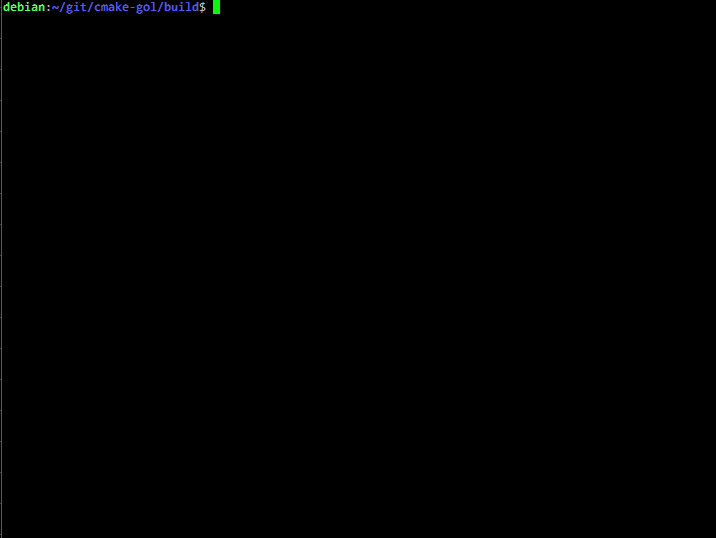

# cmake-gol
Conway's Game of Life implemented in CMake

## Usage
Simply create a new directory, enter it, and run:
`cmake path/to/project/root`

The default game area is 35x35 tiles. You may want to set your terminal height to 35 lines so that the screen refreshes as cleanly as possible.

## Example Output

Have fun!
